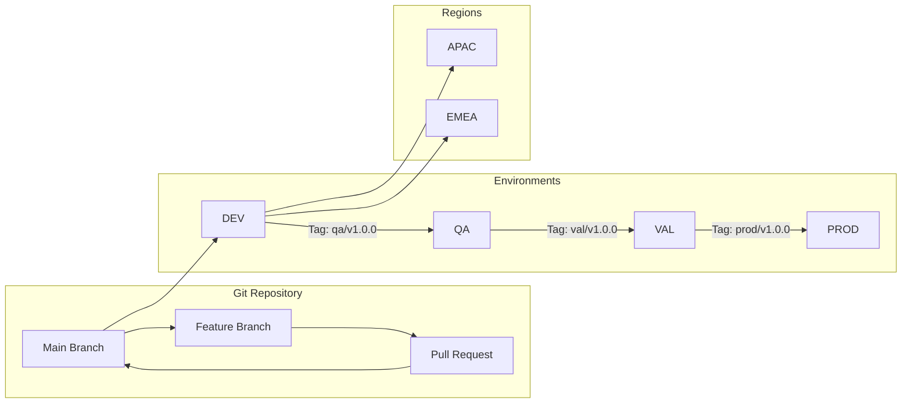

# Okta User Schema Terraform Management

This repository manages Okta custom user attributes across multiple environments and regions using Terraform, with a GitOps workflow.

## Table of Contents
- [Architecture Overview](#architecture-overview)
- [Prerequisites](#prerequisites)
- [Directory Structure](#directory-structure)
- [Git Workflow & Promotion Strategy](#git-workflow--promotion-strategy)
- [Local Development](#local-development)
- [Pipeline Configuration](#pipeline-configuration)
- [State Management](#state-management)
- [Authentication](#authentication)
- [Emergency Procedures](#emergency-procedures)

## Architecture Overview


## Prerequisites

### Required Tools
- Terraform >= 1.13.3
- Python >= 3.8
- AWS CLI
- Azure CLI (for pipeline testing)
- Git

### Required Access
- Okta OAuth Applications (8 total: 4 environments × 2 regions)
- AWS accounts with S3 permissions
- Azure DevOps project with pipeline permissions

## Directory Structure

- **`attributes/`** - YAML definitions for custom user attributes
  - `definitions/` - Base attributes applied to all environments
  - `overrides/` - Environment-specific additions/modifications
  
- **`terraform/`** - Core Terraform configuration
  
- **`environments/`** - Environment and region-specific variable files
  
- **`scripts/`** - Automation and validation scripts
  
- **`azure-pipelines/`** - CI/CD pipeline definitions

## Git Workflow & Promotion Strategy

### Branch Strategy
```
main (default branch)
├── feature/add-employee-id
├── feature/update-department-values
├── hotfix/fix-validation-pattern
└── release/v1.2.0
```

### Development Workflow

#### 1. Feature Development
```bash
# Create feature branch
git checkout -b feature/add-employee-id

# Edit attributes
vim attributes/definitions/custom_attributes.yaml

# Test locally
make validate
make plan ENV=dev REGION=apac

# Commit and push
git add .
git commit -m "feat: add employee_id attribute"
git push origin feature/add-employee-id

# Create PR to main
# PR triggers: validation, security scan, plan preview
```

#### 2. Deployment to DEV
```bash
# After PR approval and merge to main
# Automatic deployment to DEV (both APAC & EMEA)
# No manual intervention needed
```

#### 3. Promotion to QA
```bash
# After testing in DEV, create and push tag
git checkout main
git pull origin main
git tag -a "qa/v1.0.0" -m "Promote employee_id to QA"
git push origin qa/v1.0.0

# Tag triggers QA deployment pipeline
# Requires manual approval in Azure DevOps
```

#### 4. Promotion to VAL
```bash
# After QA validation
git tag -a "val/v1.0.0" -m "Promote to Validation"
git push origin val/v1.0.0

# Triggers VAL deployment with approval gate
```

#### 5. Promotion to PROD
```bash
# After VAL validation
git tag -a "prod/v1.0.0" -m "Promote to Production"
git push origin prod/v1.0.0

# Triggers PROD deployment
# Requires CAB approval + manual approval in pipeline
```

### Tag Naming Convention
```
Format: <environment>/<version>

Examples:
- qa/v1.0.0    - Initial QA release
- qa/v1.0.1    - QA patch
- val/v1.0.0   - Validation release
- prod/v1.0.0  - Production release
- prod/v1.0.1  - Production hotfix
```

### Hotfix Process
```bash
# For urgent production fixes
git checkout main
git checkout -b hotfix/fix-pattern-validation

# Make fix
vim attributes/definitions/custom_attributes.yaml

# Fast-track through environments
git tag -a "prod/v1.0.1-hotfix" -m "Emergency fix: pattern validation"
git push origin prod/v1.0.1-hotfix

# Triggers emergency pipeline with reduced approval requirements
```

## State Management

### S3 Bucket Structure
```
Environment   Bucket Name                         State Path
-----------   ---------------------------------   --------------------------------
DEV           {okta-terraform-state-prefix}-dev   {region}/terraform.tfstate
QA            {okta-terraform-state-prefix}-qa    {region}/terraform.tfstate  
VAL           {okta-terraform-state-prefix}-val   {region}/terraform.tfstate
PROD          {okta-terraform-state-prefix}-prod  {region}/terraform.tfstate

Where {region} = apac | emea
```

### Backend Configuration
```hcl
# Initialized with:
terraform init \
  -backend-config="bucket={okta-terraform-state-prefix}-${ENV}" \
  -backend-config="key=${REGION}/terraform.tfstate" \
  -backend-config="region=us-east-1" \
  -backend-config="encrypt=true" \
  -backend-config="use_lockfile=true"
```

## Authentication

### Okta OAuth Configuration

Using OAuth 2.0 with private_key_jwt assertion:
```hcl
# Pipeline secrets required per environment/region:
OKTA_{ENV}_{REGION}_ORG_NAME     # e.g., dev
OKTA_{ENV}_{REGION}_BASE_URL     # oktapreview.com or okta.com
OKTA_{ENV}_{REGION}_CLIENT_ID    # OAuth app client ID
OKTA_{ENV}_{REGION}_PRIVATE_KEY  # RSA private key (base64 encoded)
OKTA_{ENV}_{REGION}_KEY_ID       # Private key ID
OKTA_{ENV}_{REGION}_SCOPES       # okta.users.manage,okta.schemas.manage
```

### AWS Authentication

Currently using access keys in pipeline (stored in Azure Key Vault):
```
AWS_ACCESS_KEY_ID_{ENV}
AWS_SECRET_ACCESS_KEY_{ENV}
```

**Future Enhancement:** Migrate to OIDC federation

## Local Development

### Using Make (Optional but Recommended)
```bash
# Validate attribute YAML files
make validate

# Run terraform plan for specific environment
make plan ENV=dev REGION=apac

# Apply changes (local testing only)
make apply ENV=dev REGION=apac

# Compare attributes across environments
make compare

# Run smoke tests
make test ENV=dev REGION=apac

# Clean up local state
make clean
```

### Manual Commands
```bash
# Without Make
cd terraform/

# Set environment variables
export TF_VAR_environment=dev
export TF_VAR_region=apac
export OKTA_ORG_NAME=dev-123456
export OKTA_CLIENT_ID=xxx
export OKTA_PRIVATE_KEY=$(cat private.key)
export OKTA_KEY_ID=xxx

# Initialize
terraform init -backend-config=../backends/dev-apac.conf

# Plan
terraform plan -var-file=../environments/dev-apac.tfvars

# Apply (not recommended locally)
terraform apply -var-file=../environments/dev-apac.tfvars
```

## Attribute Definition Guide

### Base Attributes File
```yaml
# attributes/definitions/custom_attributes.yaml
version: "1.0"
metadata:
  description: "Base custom user attributes for Okta"
  owner: "Platform Team"
  
attributes:
  - name: "employee_id"
    type: "string"
    display_name: "Employee ID"
    description: "Unique employee identifier"
    master: "PROFILE_MASTER"
    permissions: "READ_WRITE"
    required: false
    pattern: "^EMP[0-9]{6}$"
    min_length: 9
    max_length: 9
    unique: "UNIQUE_VALIDATED"
    scope: "NONE"
    deletable: false  # Prevent accidental deletion
    
  - name: "department"
    type: "string"
    display_name: "Department"
    description: "Employee department"
    master: "PROFILE_MASTER"
    permissions: "READ_WRITE"
    required: false
    enum:
      - "Engineering"
      - "Sales"
      - "Marketing"
      - "HR"
      - "Finance"
```

### Environment Override File
```yaml
# attributes/overrides/prod.yaml
version: "1.0"
metadata:
  description: "Production-specific attribute overrides"
  
overrides:
  - name: "employee_id"
    required: true  # Make required in production
    permissions: "READ_ONLY"  # Restrict editing in production
    
additions:
  - name: "compliance_training_date"
    type: "string"
    display_name: "Last Compliance Training"
    description: "Date of last compliance training completion"
    master: "OKTA"
    permissions: "READ_ONLY"
    required: false
```

## Pipeline Stages

1. **Validate** - Syntax and security checks
2. **Plan** - Generate Terraform plan
3. **Review** - Manual approval gate (QA, VAL, PROD)
4. **Apply** - Execute Terraform changes
5. **Test** - Run smoke tests
6. **Notify** - Send deployment notifications

## Monitoring & Alerts

- **Deployment notifications:** Teams/Slack webhooks
- **Drift detection:** Daily scheduled pipeline
- **Audit logs:** Forwarded to SIEM
- **State backups:** Daily to secondary region

## Rollback Procedures

See [ROLLBACK.md](docs/ROLLBACK.md) for detailed procedures.

Quick rollback:
```bash
# Revert to previous version
git revert HEAD
git tag -a "prod/v1.0.2-rollback" -m "Rollback to v1.0.1"
git push origin prod/v1.0.2-rollback
```

## Support
- **Team:** AXON Platform Team
